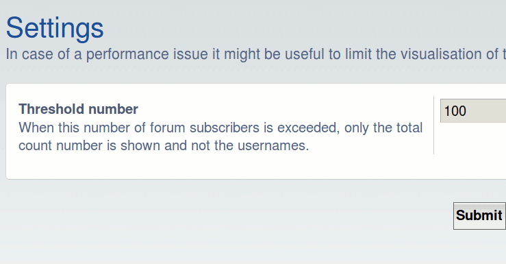

# phpBB Extension - marttiphpbb Show Forum Subscribers

## Features

* Shows the subscribers of a forum
* A threshold can be defined in ACP of the maximum number of subscribers to be shown. Above this number only the number is shown. (To be set if there is a  performance issue).

## Requirements

* phpBB 3.2.1+
* PHP 7+

## Quick Install

You can install this on the latest release of phpBB 3.2 by following the steps below:

* Create `marttiphpbb/showforumsubscribers` in the `ext` directory.
* Download and unpack the repository into `ext/marttiphpbb/showforumsubscribers`
* Enable `Show Forum Subscribers` in the ACP at `Customise -> Manage extensions`.

## Uninstall

* Disable `Show Forum Subscribers` in the ACP at `Customise -> Extension Management -> Extensions`.
* To permanently uninstall, click `Delete Data`. Optionally delete the `/ext/marttiphpbb/showforumsubscribers` directory.

## Support

* Report bugs and other issues to the [Issue Tracker](https://github.com/marttiphpbb/phpbb-ext-showforumsubscribers/issues).

## License

[GPL-2.0](license.txt)

## Screenshots

### ACP

### Viewtopic

